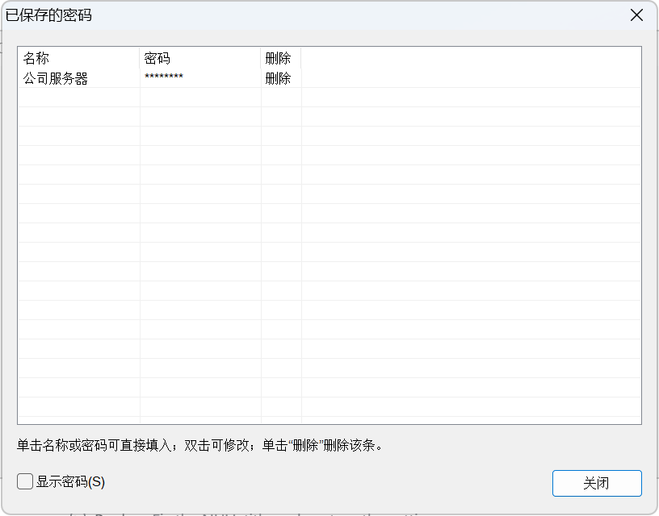
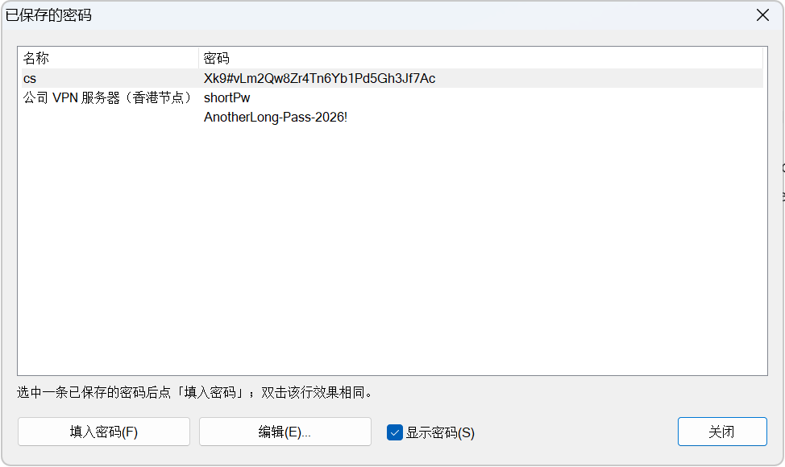

# 7-Zip Password Vault / 7-Zip 密码管家版

A modified build of **7-Zip 26.03** with an integrated, encrypted, named password vault — built directly into 7-Zip's own password dialog.

基于官方 **7-Zip 26.03 源码** 的修改版，内置「本地加密密码管理」功能，直接集成进 7-Zip 的「输入密码」对话框。

---

## English

### Features

1. **Local password storage** — save a password with a name right from 7-Zip's password dialog.
2. **Hybrid encryption** (choose in Settings):
   - **DPAPI (default)** — tied to your Windows account + machine, no master password needed.
   - **AES-256-GCM + master password (optional)** — portable; move/backup the vault to another machine.
3. **Saved-passwords window** — an ordinary two column list (`Name | Password`) with two
   ordinary buttons beneath it, so it looks and behaves like the rest of 7-Zip:
   - **Fill password** types the selected entry's password into the input box and closes
     the window (a setting keeps it open instead); **double clicking a row** does the same;
   - **Edit...** opens the selected entry for changing it or deleting it (with a
     confirmation prompt);
   - the password column shows dots unless you ask to see the passwords: the
     **Show passwords** checkbox in the window reveals them, and Fill still types the
     real password while the row is masked;
   - optionally **only the unnamed entries** show their password, so an entry saved
     without a name can still be found (see the settings page below). A
     master-password vault shows nothing until it has been unlocked.
4. **New password window** — name + password. The name may be left empty and the entry then
   stays **unnamed**, so no generated name can ever collide with a password you type.
5. **Auto-type by name** — typing the name of a saved entry in the password box fills its password.
6. **Offer to save** — entering a password that is not stored yet asks whether to save it.
7. **Password management settings page** — 7-Zip "Tools → Options" gains a new "Password manager" page.
8. **The same vault in the Add-to-Archive dialog** — 7zG's "Add to Archive" window has the
   same *Saved passwords...* / *New password...* buttons, fills **both** password fields,
   fills by typed name and offers to store a new password.
9. **Localized UI** — every new dialog, option, message box and error message is localized
   (English / 简体中文 / 繁體中文 included). None of the vault strings is hard coded: they all
   come from `Lang\*.txt`, with the Chinese text kept as the built-in fallback.

> The file manager loads its language file as `Lang\<lang>.txt` and never `.ttt`, so an English
> UI needs `Lang\en.txt` (a copy of the `en.ttt` template, which this repository ships). Without
> it, English falls back to the built-in resource strings and every string that only exists in the
> language file — the vault message boxes, list hint, prompts — would show its Chinese fallback.



With the passwords shown, the name column keeps its content width and the password
column takes the rest, so a long password is readable even when the name is short:



### Install

Two builds are published for every release:

| Build | What it is |
|-------|------------|
| `7z-password-vault-<version>-win64-portable.zip` | **The download.** Unpack anywhere and run `7zFM.exe`. Nothing is written outside that folder except 7-Zip's own per-user settings in `HKCU\Software\7-Zip`, plus what you agree to on the first start (see below). |
| `install.cmd` (inside the zip) | Optional manual entry point: creates the Start Menu / desktop shortcuts and the entry in *Apps & features* right away. The program offers the same thing itself on its **first start**, after asking — current user only, no administrator rights, and "No" leaves everything working. |
| `uninstall.cmd` (inside the zip) | Removes the shortcuts, the *Apps & features* entry, the associations that point into this folder and the folder itself; it asks first whether the vault file should be kept. |

Why there is no `setup.exe` any more: the 7-Zip SFX stub cannot run a program after unpacking
(measured — it ignores its configuration), so a self-extracting download looked like an
installer while only being an unpacker, and VirusTotal engines score that wrapper shape
(Elastic and CrowdStrike flagged it even though the payload alone is clean — see
`docs/vt-attribution.md`). The zip plus the program's own first-start question does the same
job without the detections.

After installing, associations and file icons are one step away: **Tools → Options →
System**, tick `7z`, `zip`, … and press OK. A portable copy is not associated with
anything by itself — that is what the official installer used to do.
### Saved-passwords window

Open it with the **Saved passwords...** button in the password dialog. It stays open while you pick,
so you can compare several entries; the hint line shows which entry was filled.

| Action | Result |
|--------|--------|
| Select a row, then click **Fill password** | Types that entry's password into the input box and closes the window (see the *Close the window...* setting) |
| Double click a row | The same as **Fill password** |
| Select a row, then click **Edit...** | Opens the **Edit password** window, which can also **Delete** the entry after a confirmation prompt |
| Click **Show passwords** | Reveals the password column (masked by default); Fill works either way |
| Click **Close** | Closes the window; the input box keeps whatever was filled |

### Settings page (Tools → Options → Password manager)

| Option | Meaning |
|--------|---------|
| Vault path (empty = default) | Custom vault file location. The default is **next to the program** (`<program folder>\7zPasswordVault.dat`), so the vault does not use space on the system drive; if the program folder cannot be written (an installation under `Program Files`), `%APPDATA%\7-Zip\7zPasswordVault.dat` is used instead, and a vault that is still there is moved next to the program on the first run. **When both files exist** the program asks once which one to use — *Yes* takes the one next to the program, *No* the one in the user folder, *Cancel* decides nothing and asks again on the next start — and remembers the answer, so the question never comes back; the file that was not chosen is left untouched. **A folder works too** — the Browse button picks one — and the vault file inside it is then used (`<folder>\7zPasswordVault.dat`); a quoted path (as Explorer copies it) is accepted as well. |
| Browse... | Pick the vault file location |
| Use master password (portable) | Encrypt the vault with AES-256-GCM + master password |
| Set master password... | Set / change the master password (entered twice) |
| Clear master password... | Re-encrypt with DPAPI (removes the master password requirement) |
| Remember master password this session | Ask for the master password only once per run |
| Auto-lock the master password after 5 idle minutes | Forget the cached master password after 5 minutes |
| Show password by default | Show the password in clear text by default |
| Close the window after a saved password was typed in | The Fill action closes the list window; switch off to keep it open and pick several entries |
| Auto-fill the password when a saved name is typed | Turn off to be asked before filling |
| Offer to save an unsaved password | Turn off to never be asked to store a new password |
| Show saved passwords in the list | Reveal the password column by default; the list window also has its own **Show passwords** checkbox |
| Show password of unnamed entries | An entry saved without a name has nothing in the name column, so it is hard to find. This shows the password of those rows only (named rows stay masked), which makes such entries identifiable. A master-password vault still shows nothing until it has been unlocked. |
| Export vault... / Import vault... | Copy the vault to/from another file |

### Build

MinGW-w64 (GCC):

```bat
cd CPP\7zip\UI\GUI
make -f ../../cmpl_gcc.mak
cd ..\FileManager
make -f ../../cmpl_gcc.mak
```

Outputs are in `b\g\`. The object directory (`b\g`) must exist first — the makefile's `mkdir`
rule only works inside an MSYS shell:

```bat
mkdir CPP\7zip\UI\GUI\b\g 2>nul
mkdir CPP\7zip\UI\FileManager\b\g 2>nul
```

Run the executables next to the official `7z.dll` and `Lang\` folder.

MSVC (nmake): use `GUI\makefile` and `FileManager\makefile` (already link `crypt32.lib` + `bcrypt.lib`).

### Tests

Two suites, both plain PowerShell (no test framework):

| Suite | What it covers | Checks |
|-------|----------------|--------|
| `tests\core-test.ps1` | 7-Zip's own engine through `7z.exe`: create / list / test / extract for 7z, zip and tar, AES-256 and ZipCrypto zips, header encryption, wrong passwords, damaged and truncated archives, 60+ file and long-name archives | 39 |
| `tests\ui-test.ps1` | the vault in the real dialogs of `7zFM.exe` / `7zG.exe`: fill, edit, delete, unnamed entries, showing the password of unnamed entries, many entries, name/password collisions, awkward names, Chinese names and passwords, master-password mode, moving (copying) a vault, export/import, the settings page, plus end-to-end runs where a vault password really extracts an archive and the compress dialog really encrypts one | 266 |
| `tests\uninstall-test.ps1` | the uninstaller, on a fake installation in `%TEMP%`: the vault is kept or deleted as asked, the settings key / per-user associations / shell-extension registration / shortcuts / folder are removed, `-WhatIf` changes nothing, and the settings backup is written. It backs up and restores `HKCU\Software\7-Zip` and the real vault itself | 20 |
| `tests\check-labels.ps1` | measures every label of every dialog against its control and reports the ones that are cut off — run it after adding or editing a translation | 0 clipped (en) |

`tests\ui-test.ps1` drives the real dialogs through Win32 messages and real mouse input:

```powershell
pwsh -NoProfile -File tests\ui-test.ps1
pwsh -NoProfile -File tests\ui-test.ps1 -SevenZipDir "D:\path\to\7-Zip"
pwsh -NoProfile -File tests\ui-test.ps1 -UiLang en      # against the English UI
pwsh -NoProfile -File tests\core-test.ps1               # 7-Zip engine, no UI needed
pwsh -NoProfile -File tests\check-labels.ps1 -UiLang en # are any labels cut off?
```

It exits non-zero when a check fails. Both suites print `[PASS]`/`[FAIL]` per check; run them after
every rebuild.

* The run is **isolated from your own data**: it points `VaultPath` at a file inside its work
  directory and restores the whole `HKCU\Software\7-Zip\PasswordVault` key afterwards, also when
  it crashes. Your real vault in `%APPDATA%\7-Zip` is never read or written.
* It clicks and types with the **real mouse and keyboard**, so the cursor is taken over for the
  duration of the run.
* Dialog titles come from the language files, so the suite runs against any language this
  repository ships: `-UiLang auto` (default) follows the 7-Zip `Lang` setting and the system UI
  language; `-UiLang en` or `-UiLang zh-cn` force one. When a window is not found the run prints
  the titles it did find, to make a language mismatch obvious.
* It stops only the `7zFM.exe` it started, so a file manager you have open is not killed.

### Uninstall

The installer build registers itself in *Apps & features*; the portable build has
nothing there. Either way run
`uninstall.cmd` in the program folder (or `pwsh -File uninstall.ps1`):

```bat
uninstall.cmd                 :: asks whether to keep the vault, then confirms
uninstall.cmd -KeepVault      :: never delete the vault file
uninstall.cmd -DeleteVault    :: delete it without asking
uninstall.cmd -AllUsers       :: also machine-wide leftovers, needs an admin prompt
uninstall.cmd -NoBackup       :: do not write the settings backup
uninstall.cmd -WhatIf         :: only print what would be removed
```

It stops the `7zFM`/`7zG` processes started from that folder, removes
`HKCU\Software\7-Zip` (the vault options and 7-Zip's own per-user settings), the
per-user file associations and the shell-extension registration **that point at that
folder**, shortcuts that point at it, and the folder itself. Before the settings key
is deleted it is exported to `%TEMP%\7zip-vault-settings-<date>.reg`, because that key
also holds the vault path, and the summary tells you how to restore it
(`reg import "<file>"`). The vault file is the one thing you choose: keep it and a
reinstall finds your passwords again without a manual step: it is moved to
`%APPDATA%\7-Zip\7zPasswordVault.dat`, which is where the program looks next. Only the
files that ship with the package are removed from the folder, so a folder that also
holds your own files is kept (and reported) instead of being emptied.
Archives and documents are never touched.
### Verifying the binaries

`BUILD.md` records how the release binaries are produced, what they import, and what to do
about the antivirus false positives that a modified, unsigned `7zG.exe` will always attract.

### Security

- DPAPI mode: decryptable only by the current Windows account on the current machine. Entry names
  are encrypted as well as the passwords.
- Master-password mode: AES-256-GCM with a key derived via PBKDF2-HMAC-SHA256 (Windows CNG/bcrypt),
  per-vault random salt and nonce.
- The vault is written through a temporary file and an atomic replace, so an interrupted write
  cannot destroy an existing vault.
- Master password, derived keys and plaintext buffers are wiped from memory after use.

### License

Based on 7-Zip source, under its original license (GNU LGPL, except unRar). See `DOC\License.txt` and `DOC\copying.txt`.

---

## 中文

### 功能

1. **本地存储密码** —— 在密码对话框里点「新建密码...」保存，密码写入本地加密密码库文件。
2. **加密存储（混合方案）**：
   - **DPAPI（默认）**：Windows 账户 + 电脑绑定，免主密码；**名称与密码都加密**。
   - **AES-256-GCM + 主密码（可选）**：可移植，可备份/迁移到其它电脑。
3. **已保存的密码窗口** —— 普通的两列列表（`名称 | 密码`）加上两个普通按钮，
   外观与操作方式都和 7-Zip 其它窗口一致：
   - **填入密码** → 把选中那一条的密码键入输入框并关闭窗口（可在设置里改为保持打开）；
     **双击整行**效果相同；
   - **编辑...** → 打开选中那条进行修改，也可在窗口内**删除**（有二次确认）；
   - 密码列默认显示为圆点；窗口里的**「显示密码」**复选框可临时显示明文，
     被遮挡时「填入密码」依然键入真实密码；
   - 也可以设置成**只让无名称的条目**直接显示密码（见下面设置页），
     这样没起名字的条目也能找出来。设了主密码的密码库必须先解锁成功才会显示。
4. **新建密码窗口** —— 填写名称 + 密码；**名称可以留空**，留空即保持**无名称**，
   这样自动命名永远不会和用户输入的密码冲突。
5. **按名称自动键入** —— 在密码框里输入已保存的名称，自动填入该名称下的密码。
6. **提示保存** —— 输入密码库里没有的密码时，弹窗询问是否保存到密码库。
7. **密码管理设置页** —— 7-Zip「工具 → 选项」新增「密码管理」页。
8. **压缩对话框同样接入密码库** —— 7zG 的「添加到压缩包」窗口也有「已保存的密码...」
   与「新建密码...」按钮，会**同时填入两个密码框**，同样支持按名称填入与提示保存。
9. **多语言** —— 新增的对话框、选项、消息框与错误提示**全部**走语言文件
   （英文 / 简体中文 / 繁体中文），代码里不再有写死的中文（中文文本仅作为语言文件缺失时的兜底）。

> 文件管理器只加载 `Lang\<语言>.txt`，**不会加载 `.ttt`**。因此英文界面需要 `Lang\en.txt`
> （即 `en.ttt` 模板的副本，本仓库已提供）。缺少它时英文会退回内置资源字符串，而只存在于
> 语言文件里的字符串（密码库消息框、列表提示、各种询问）会退回中文兜底文本。


显示密码时，名称列保持内容宽度、密码列占满剩余空间，所以名称很短、密码很长时也能完整看清：


### 安装

每个版本发布两个包：

| 包 | 说明 |
|----|------|
| `7z-password-vault-<版本>-win64-portable.zip` | **唯一发布的下载**：解压到任意位置直接运行 `7zFM.exe`。除了 7-Zip 自己的每用户设置（`HKCU\Software\7-Zip`）与你在首次启动时同意的内容之外，不往目录外写任何东西。 |
| `install.cmd`（在压缩包里） | 可选的手动入口：立刻创建开始菜单 / 桌面快捷方式与「应用和功能」登记项。程序**首次启动**时自己也会问一次同样的事 —— 只写当前用户、不需要管理员权限，选「否」也照常使用。 |
| `uninstall.cmd`（在压缩包里） | 删除快捷方式、指向本目录的关联、「应用和功能」登记项和整个目录；删除前会先问是否保留密码库。 |

为什么不再有 `setup.exe`：7-Zip 的 SFX 存根**不能**在解包后执行程序（实测：它不解析配置），所以自解压包
看起来像安装器、实际只是解包器，而杀毒引擎会为这种外壳形态扣分（Elastic 与 CrowdStrike 即使面对干净载荷
也会打标，见 `docs/vt-attribution.md`）。改用 zip + 程序首启询问，功能一样而不带这些检测。

安装完成后，关联与文件图标只差一步：**工具 → 选项 → 系统**，勾选 `7z`、`zip` 等，
确定即可。便携版默认不会关联任何格式 —— 以前那是官方安装程序做的事。
### 已保存的密码窗口

在密码对话框里点「已保存的密码...」打开。窗口**不会因为填入而关闭**，方便对比多条记录；
提示行会显示刚刚填入了哪一条。

| 操作 | 结果 |
|------|------|
| 选中一行后单击**填入密码** | 该条密码键入到输入框，随后关闭窗口（见「填入密码后关闭窗口」设置） |
| 双击某一行 | 与**填入密码**相同 |
| 选中一行后单击**编辑...** | 打开「修改密码」窗口，窗口内可**删除**该条（有二次确认） |
| 单击**显示密码** | 显示明文密码列（默认以圆点遮挡）；遮挡时「填入密码」照常可用 |
| 单击**关闭** | 关闭窗口，输入框中已填入的内容保留 |

### 密码管理设置页（工具 → 选项 → 密码管理）

| 选项 | 说明 |
|------|------|
| 密码库位置（留空使用默认） | 自定义密码库文件存放路径。默认放在**程序所在文件夹**（`<程序目录>\7zPasswordVault.dat`），不占用系统盘；若程序目录不可写（例如装在 `Program Files`），则退回 `%APPDATA%\7-Zip\7zPasswordVault.dat`，并且仍在旧位置的密码库会在首次运行时移动到程序目录。**两个位置都有密码库时**，程序只问一次用哪一个 —— 「是」用程序目录里的，「否」用用户目录里的，「取消」本次不决定、下次启动再问 —— 并记住你的选择，以后不再询问；没被选中的那个文件保持原样。**也可以直接填文件夹**（「浏览...」选的就是文件夹），此时使用该文件夹里的 `7zPasswordVault.dat`；带引号的路径（从资源管理器复制来的）同样可用。 |
| 浏览... | 选择密码库文件位置 |
| 使用主密码加密（可移植） | 开启后用 AES-256-GCM + 主密码加密，可迁移到其它电脑 |
| 设置主密码... | 设置 / 修改主密码（输入两次） |
| 清除主密码... | 改回 DPAPI 加密（不再需要主密码） |
| 本次会话记住主密码 | 开启后本次运行只输入一次主密码 |
| 主密码闲置 5 分钟后自动锁定 | 闲置 5 分钟后清除内存中缓存的主密码 |
| 默认显示密码 | 密码框默认显示明文 |
| 填入密码后关闭窗口 | 点「填入」后关闭列表窗口；关闭该选项则保持打开，便于连续挑选 |
| 输入已保存的名称时自动填入密码 | 关闭后改为先询问再填入 |
| 输入未保存的密码时提示保存 | 关闭后不再询问是否保存新密码 |
| 在列表中显示已保存的密码 | 默认在列表中显示明文；列表窗口里也有自己的「显示密码」复选框 |
| 未命名条目直接显示密码 | 没起名字的条目在名称列是空的，很难辨认；开启后**只有这些条目**直接显示密码（有名称的仍然打码），方便查找。设了主密码的密码库必须先解锁成功才会有内容显示。 |
| 导出密码库... / 导入密码库... | 把密码库复制到 / 从其它文件导入 |

### 构建

MinGW-w64（GCC）：

```bat
cd CPP\7zip\UI\GUI
make -f ../../cmpl_gcc.mak
cd ..\FileManager
make -f ../../cmpl_gcc.mak
```

产物在各自目录 `b\g\` 下。**首次构建需先手动创建对象目录**——makefile 里的 `mkdir` 规则
只在 MSYS 环境下可用：

```bat
mkdir CPP\7zip\UI\GUI\b\g 2>nul
mkdir CPP\7zip\UI\FileManager\b\g 2>nul
```

运行需同目录的官方 `7z.dll` 与 `Lang\`（可从官方 7-Zip 26.03 安装包获取）。

MSVC（nmake）：使用 `GUI\makefile` 与 `FileManager\makefile`（已链接 `crypt32.lib` + `bcrypt.lib`）。

### 测试

两套测试，均为纯 PowerShell，不需要测试框架：

| 测试 | 覆盖内容 | 项数 |
|------|----------|------|
| `tests\core-test.ps1` | 通过 `7z.exe` 验证 7-Zip 引擎本身：7z / zip / tar 的创建·列表·校验·解压、AES-256 与 ZipCrypto、加密文件名、错误密码、损坏与截断压缩包、60+ 文件与超长文件名 | 39 |
| `tests\ui-test.ps1` | 真实对话框里的密码库：填入 / 编辑 / 删除、无名称条目、未命名条目直接显示密码、多条目、名称与密码冲突、特殊名称、中文名称与中文密码、主密码模式、密码库搬家（复制到别的路径）、导出 / 导入，以及**端到端**（密码库里的密码真的解开了压缩包、压缩对话框真的加密了压缩包） | 266 |
| `tests\uninstall-test.ps1` | 卸载程序（在 `%TEMP%` 里造一个假安装目录）：按要求保留或删除密码库，删除设置键 / 每用户关联 / 右键菜单扩展注册 / 快捷方式 / 整个目录，`-WhatIf` 不动任何东西，并写出设置备份。测试自身会备份并还原 `HKCU\Software\7-Zip` 与真实密码库 | 20 |
| `tests\check-labels.ps1` | 逐一测量每个对话框中每个标签的文本宽度与控件宽度，报告被截断的标签 —— 新增或修改翻译后应运行 | 英文 0 处截断 |

`tests\ui-test.ps1` 通过 Win32 消息与真实鼠标输入驱动真实对话框：

```powershell
pwsh -NoProfile -File tests\ui-test.ps1
pwsh -NoProfile -File tests\ui-test.ps1 -SevenZipDir "D:\path\to\7-Zip"
pwsh -NoProfile -File tests\ui-test.ps1 -UiLang en      # against the English UI
pwsh -NoProfile -File tests\core-test.ps1               # 7-Zip 引擎，无需界面
```

有失败项时以非零码退出，两项逐条打印 `[PASS]`/`[FAIL]`；每次重新构建后都应运行。

* 测试与**你自己的数据完全隔离**：它把 `VaultPath` 指向自己工作目录下的文件，并在结束后
  （即使中途崩溃）整体恢复 `HKCU\Software\7-Zip\PasswordVault` 键。`%APPDATA%\7-Zip`
  下的真实密码库不会被读取或写入。
* 测试使用**真实鼠标与键盘**输入，运行期间会占用光标。
* 窗口标题来自语言文件，支持本仓库提供的所有语言：`-UiLang auto`（默认）跟随 7-Zip 的
  `Lang` 设置与系统界面语言，`-UiLang en` / `-UiLang zh-cn` 可强制指定；找不到窗口时会打印
  实际存在的窗口标题，便于判断是否为语言不匹配。
* 只关闭测试自己启动的 `7zFM.exe`，不会影响你已经打开的窗口。

### 改动文件

| 文件 | 说明 |
|------|------|
| `CPP/7zip/UI/FileManager/PasswordVault.h` / `.cpp` | 新增：DPAPI + AES-256-GCM 混合加密、密码库存储、主密码对话框 |
| `CPP/7zip/UI/FileManager/PasswordListDialog.h` / `.cpp` | 新增：四列「已保存的密码」窗口（名称 / 密码 / 填入 / 编辑） |
| `CPP/7zip/UI/FileManager/PasswordVaultUi.h` / `.cpp` | 新增：解压与压缩对话框共用的密码库交互（填入 / 新建 / 按名称填入 / 提示保存） |
| `CPP/7zip/UI/GUI/CompressDialog.h` / `.cpp` / `.rc` / `CompressDialogRes.h` | 修改：「添加到压缩包」窗口接入密码库 |
| `BUILD.md` | 新增：构建复现、二进制校验、杀毒误报与代码签名说明 |
| `tests/core-test.ps1` | 新增：7-Zip 引擎功能测试（创建 / 校验 / 解压 / 加密 / 损坏包） |
| `CPP/7zip/UI/FileManager/PasswordDialog.h` / `.cpp` / `.rc` / `PasswordDialogRes.h` | 修改：密码对话框改为「已保存的密码... / 新建密码...」按钮，新增新建/修改窗口、按名称自动键入、保存提示 |
| `CPP/7zip/UI/FileManager/PasswordPage.h` / `.cpp` / `.rc` / `PasswordPageRes.h` | 新增：密码管理设置页（含导出/导入、清除主密码） |
| `CPP/7zip/UI/FileManager/OptionsDialog.cpp` | 修改：注册密码管理设置页 |
| `CPP/7zip/UI/Common/ZipRegistry.h` / `.cpp` | 修改：新增密码库设置读写 |
| `CPP/7zip/UI/GUI/UpdateCallbackGUI2.cpp` | 修改：右键解压路径也遵循「默认显示密码」 |
| `CPP/7zip/UI/GUI/makefile` / `makefile.gcc` | 修改：GUI 构建文件（链接 bcrypt） |
| `CPP/7zip/UI/FileManager/FM.mak` / `makefile.gcc` | 修改：FM 构建文件（链接 bcrypt） |
| `CPP/7zip/7zip_gcc.mak` | 修改：新增编译规则、链接 bcrypt、**头文件依赖跟踪（-MMD -MP）** |
| `Lang/en.ttt` / `en.txt` / `zh-cn.txt` / `zh-tw.txt` | 修改：新增界面字符串本地化（`en.txt` 为英文界面实际加载的文件） |
| `tests/ui-test.ps1` | 新增：界面与端到端测试（153 项） |

### 开发注意（重要）

7-Zip 自带的 GCC makefile **不跟踪头文件依赖**。修改任何 `.h` 后如果只做增量编译，
包含该头文件的其他 `.cpp` 不会重新编译，会造成**类布局不一致**（不同目标文件对同一成员的
偏移量理解不同），从而出现内存踩踏 / 崩溃。

本仓库已在 `7zip_gcc.mak` 中加入 `-MMD -MP` 与 `-include $(OBJS:.o=.d)` 自动跟踪头文件依赖。
若在旧版构建脚本上开发，**改过头文件后请务必全量重编**：

```bat
del /q CPP\7zip\UI\GUI\b\g\*.o CPP\7zip\UI\FileManager\b\g\*.o
make -f ../../cmpl_gcc.mak
```

### 健壮性设计

- 密码库采用**临时文件 + 原子替换**写入，写入过程中崩溃/断电不会损坏已有密码库。
- 读取时会校验条数、名称长度、密文长度与 PBKDF2 迭代次数，避免损坏文件导致巨额内存分配或长时间卡死。
- 主密码、派生密钥、明文缓冲在使用后会被**主动清零**。

### 卸载

安装版会出现在「应用和功能」里，便携版不会。两种情况都可以运行程序目录下的 `uninstall.cmd`
（或 `pwsh -File uninstall.ps1`）：

```bat
uninstall.cmd                 :: 先问是否保留密码库，再确认一次
uninstall.cmd -KeepVault      :: 一定保留密码库文件
uninstall.cmd -DeleteVault    :: 直接删除密码库，不再询问
uninstall.cmd -AllUsers       :: 连机器级残留一起清（需要管理员）
uninstall.cmd -NoBackup       :: 不写设置备份
uninstall.cmd -WhatIf         :: 只打印将删除什么，不动手
```

它会结束从该目录启动的 `7zFM`/`7zG` 进程、删除 `HKCU\Software\7-Zip`（密码库选项
与 7-Zip 自身的每用户设置）、**指向该目录的**每用户文件关联与右键菜单扩展注册、
指向它的快捷方式，最后删掉整个目录。删除设置键之前会先把它导出到
`%TEMP%\7zip-vault-settings-<日期>.reg`（该键里也存着密码库路径），结尾会打印文件位置与
恢复命令 `reg import "<文件>"`。唯一由你决定的是密码库文件：选**保留**时它会先被移出程序目录到
`%APPDATA%\7-Zip\7zPasswordVault.dat`（程序在程序目录找不到库时正是去这里找），因此重装后无需手工
步骤即可继续使用；目录里只删随包发布的文件，若目录里还有你自己的东西则整个保留并列出。原说明如下
（保留语义见上）：
（设置键会在下一次保存时自动重建）。压缩包和文档等数据一律不动。
### 校验二进制 / 误报处理

`BUILD.md` 记录了发布包里两个 exe 的构建方式、导入的 DLL，以及「被修改且未签名的
`7zG.exe` 必然会被部分杀毒软件误报」的处理办法（加排除项 / 提交误报 / 代码签名）。

### 安全说明

- DPAPI 模式：仅当前 Windows 账户在当前电脑上可解密。
- 主密码模式：AES-256-GCM，密钥由 PBKDF2-HMAC-SHA256 派生（Windows CNG/bcrypt）。
- 密码库文件：`%APPDATA%\7-Zip\7zPasswordVault.dat`（可自定义）。

### 许可

本修改基于 7-Zip 源码，遵循其原有许可（GNU LGPL，unRar 部分除外）。详见 `DOC\License.txt` 与 `DOC\copying.txt`。
