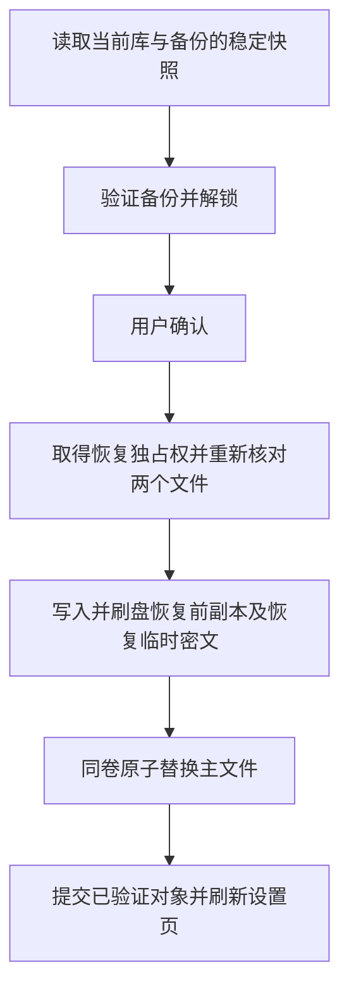

# “恢复上一版本”功能实施计划

日期：2026-09-24。状态：核心事务、设置页按钮与自动化测试已实现，正在完成候选验收。最新结果与未完成范围见 `restore-validation.md`，下文保留原计划作为验收依据。

用户已选择：设置页增加“恢复上一版本”按钮和确认窗口，只恢复当前密码库对应的 `.bak`。不制作任意备份选择向导。

规划模型：用户确认已切换 GPT-6 Astra / High；此记录依据用户确认，不代表程序自动读取或修改了模型配置。

## 1. 基线、目标与范围

- 审计基线：`bc5e6f1d8e0a01ea5da57d43dfb2a3bb8c49acea`，本地标签 `v1.5.0`。规划前工作区无未提交改动。
- 在当前配置的密码库位置恢复上一代有效备份；恢复前保存当前文件的原始密文，错误或取消不得损坏当前库。
- 验收范围为 Windows 11 Insider x64，必须包括独立标准账户。真实磁盘满测试可由管理员在隔离测试卷执行。
- 继续采用未签名 portable ZIP；Defender 复核暂不纳入本功能，不改变真实扫描状态。
- 已发布的 v1.5.0 产物不覆盖；建议本功能使用新的功能版本候选（如 v1.6.0），实际版本号在发布阶段确定。
- 不改加密算法，不新增云服务、自动恢复、条目合并、多代备份管理或任意文件恢复。现有手动恢复和导入功能保留。

## 2. 已审计的实现边界

| 位置 | 当前行为 | 对恢复功能的影响 |
| --- | --- | --- |
| `PasswordVault.cpp` 的 `Save/SaveFile` | 保存前把旧主文件发布到 `.bak`，随后替换主文件 | 恢复不能直接走普通保存流程，否则可能覆盖恢复源；需要独立恢复事务 |
| `PasswordVault.cpp` 的 `Load` | 读取文件自身的加密模式；不存在的文件作为新空库处理 | 验证备份必须明确要求文件存在，不能把缺失备份当成有效空库 |
| `CVaultSaveLock`、路径检查 | 规范化路径，拒绝文件叶节点的目录、重解析点和多硬链接 | 恢复源、目标、安全副本及临时文件需要同等保护；检查必须覆盖提交前的路径变化 |
| `Save` 的并发合并 | 可以把旧对象的局部改动合并到磁盘上的新版本 | 仅串行化文件替换不足以保护恢复；必须防止旧窗口把已撤回的数据写回 |
| `PasswordPage.cpp` 的 `OnApply` | 迁移或重加密成功后提交设置 | 恢复不能顺便提交尚未应用的路径、主密码模式或其他复选框 |
| 主密码缓存、密码库 UI | 使用进程内缓存和已加载条目 | 验证备份可能需要旧主密码；恢复后必须刷新对象并隔离旧缓存 |
| v2/v3/v4 读取 | 支持历史格式；旧 DPAPI 格式的认证范围不同 | 首期自动恢复只接受 v4，不把旧格式的可读取性描述成整库完整性验证 |
| 原生和 GUI 测试 | 已有保存故障、备份、并发和升级回滚用例 | 可以扩展，但旧结果不能证明新恢复逻辑通过 |

涉及文件：`CPP/7zip/UI/FileManager/PasswordVault.{h,cpp}`、`PasswordPage.{h,cpp,rc}`、`PasswordPageRes.h`、密码库 UI/列表调用点、`CPP/7zip/UI/Common/ZipRegistry.{h,cpp}`（按需要）、三种已打包语言资源、原生与 GUI 测试及发布文档。

## 3. 用户操作约定

1. 在“工具 → 选项 → 密码管理”点击“恢复上一版本…”。操作针对已经应用的当前密码库路径。页面存在尚未应用的修改时，提示先应用或取消修改，绝不隐式保存。
2. 明确检查 `<当前文件>.bak` 是否存在且为安全的普通文件。没有备份、格式不支持、路径受限时显示具体原因。
3. 读取备份的稳定密文快照，验证 v4 格式、长度边界、加密认证和条目解析。主密码备份明确要求输入备份当时的主密码，不能默用当前缓存密码。DPAPI 使用当前 Windows 账户验证。
4. 验证后显示确认窗口：当前库路径、备份文件及其文件修改时间、已验证的加密模式和条目数量。时间仅作为文件信息，不称为可信的备份生成时间；不显示条目名称或密码。
5. 确认文字说明：“当前密码库将恢复为上一版本，最近的修改将撤回，已删除的条目可能重新出现。恢复前会保留当前文件的加密副本。此备份可能使用旧主密码。”默认按钮为“取消”。
6. 用户确认后提交恢复。成功窗口给出恢复前安全副本的确切位置；若当前库原本缺失，说明本次没有恢复前副本。

恢复前副本建议命名为 `<当前文件>.pre-restore-<UTC时间>-<随机ID>`，独占创建，不覆盖同名文件。成功后保留供用户找回刚撤回的修改，不自动清理。`.bak` 在本次恢复中保持字节不变；以后的正常保存仍按原规则轮换 `.bak`。

当前库即使损坏，只要可以安全读取和保留其原始字节，也允许恢复有效备份；不要求先解密损坏的当前库。当前库因权限或占用无法保留时中止恢复。当前库不存在时允许恢复，但必须确认它在提交前仍不存在。主文件和备份完全相同时提示“已经是此版本”，不写文件、不额外制造副本。

## 4. 核心恢复事务

恢复应提供独立的准备、验证和提交接口；具体函数名在阶段 1 固定。核心层不依赖设置页，以便原生测试直接验证生产逻辑。

### 提交前

- 主文件、备份和创建目标的路径身份检查与现有规范化规则一致；拒绝目录、重解析点和多硬链接别名。对句柄及文件身份进行核对，不能只在最初调用一次属性检查。
- 用户输入密码和确认期间不长期持有现有保存互斥锁。提交时取得恢复独占权及主库保存锁，重新确认路径、存在性和两个文件的内容与准备阶段一致；任何变化要求重新开始，不自动恢复另一代备份。
- 验证和发布必须使用同一份密文快照，不能校验后再次按路径复制一个可能已经变化的文件。
- 先独占创建恢复前副本，写入当前文件的原始字节，刷盘、检查关闭结果并核验内容。安全副本不可用就中止，不替换当前库。
- 再独占创建同目录恢复临时文件，写入已认证的备份密文，刷盘、检查关闭结果并核验。不得写明文临时文件。
- 文件权限不能因临时文件或副本创建而扩大；阶段 1 明确当前主文件 ACL 的保留方式，主文件缺失时采用目标用户目录的受限继承规则。

### 提交与收尾

- 同卷原子替换主文件是唯一提交点。不能先删除主文件再复制；不能把恢复源轮换到 `.bak`。
- 提交点前的取消、验证失败、权限/磁盘错误、冲突或异常：主文件与 `.bak` 保持原状，活动条目与持久设置不变，清除本次接触的主密码缓存。
- 成功后采用已经认证的候选条目、密文快照及加密模式，刷新对象基线和设置页；不能在替换后才第一次解密或再次询问主密码。
- 清除恢复操作中的主密码缓存，包括成功路径，避免旧密码影响其他库。后续打开按正常记住密码策略重新解锁。
- 磁盘文件与注册表不存在跨资源原子提交。文件内模式为准；仅同步需要更新的加密模式，不写回整份旧设置。设置写入/界面刷新失败必须显示“文件已恢复，但设置刷新失败”，不得声称“未改变当前库”，也不再盲目反向覆盖文件。
- 对崩溃点逐个验证：提交前主文件仍是原版本；提交后主文件为已验证的恢复版本，恢复前密文副本仍可定位。启动时只报告残留恢复材料，不自动覆盖密码库。
- 清理只针对本次独占创建、身份可核对的临时文件。完整的恢复前副本保留；清理失败与恢复提交结果分开报告。

### 并发安全是实施前置条件

建议为新版的活动密码库会话引入共享使用权，恢复取得独占使用权；多个普通会话仍可并发保存。其他会话尚在使用该库时，恢复返回“请先关闭使用此库的密码窗口”，不终止进程、不注入代码。

阶段 1 必须确定跨进程使用权的具体机制、路径身份、锁顺序和进程崩溃后释放行为，并写出最小验证。不能只使用不持久的窗口通知、PID 枚举或原来的短期保存锁来宣称解决旧对象问题。恢复准备对象不得把自己永久阻塞在共享使用权中；失败要有有限等待和可取消反馈。

在其他窗口/进程打开期间，要么恢复明确拒绝，要么旧对象被可靠失效并重新认证；禁止恢复成功后旧会话仍能无提示填入或写回旧数据。保留现有 200 次并发保存的断言，不以删除合并能力或跳过测试换取恢复通过。

v1.5.0 等旧程序不能参与新增协调协议；产品提示恢复前关闭旧版本进程，文档明确不保证与旧版同时操作同一密码库的行为。新代码不能据此免除新版之间的自动冲突防护。

## 5. 按依赖排序的阶段

| 阶段 | 职责与推荐模型/强度 | 交付物 | 完成条件 |
| --- | --- | --- | --- |
| 1. 固定恢复协议 | 架构/安全：GPT-6 Astra / High | 恢复状态与结果类型、文件布局、ACL 策略、跨进程使用权方案、故障矩阵 | 对每个提交前后错误都能指出磁盘、内存、缓存和设置应处于什么状态；并发和崩溃最小验证可执行 |
| 2. 核心事务与原生回归 | 核心实现/验证：GPT-6 Astra / High | 独立恢复 API、必要的会话协调、原生恢复用例及日志 | 正常恢复、取消、错误密码、损坏、权限/磁盘故障、并发和崩溃用例通过；现有安全用例与 200 次并发保存仍通过 |
| 3. 设置页与交互 | UI 实现：GPT-6 Sol / High；继续 Astra / High 也适用 | 按钮、确认/结果界面、旧主密码流程、中文简体/繁体/英语文案、GUI 用例 | 无隐式提交其他设置；恢复完成后可填入、修改、保存；标准账户可完成整个流程；显示缩放、键盘和取消路径正常 |
| 4. 候选版验收与发布准备 | 整合/安全复核：GPT-6 Astra / High | 干净构建、冻结候选、原始证据、更新的 README/BUILD/发布说明 | 同哈希候选完成本计划测试矩阵；未完成或环境受限项如实记录；门禁通过后才准备新正式版本 |

这些是阶段执行建议，不表示模型已经切换。当前按用户确认的 Astra / High 规划；之后可由同一执行者继续完成全部阶段，无需为了分工创建多个代理。若实际执行需要更换主模型，按所选规划技能在阶段边界说明理由并等待用户选择。

进入实现时先检查当时的 git diff，再从基线创建 `codex/restore-previous-version` 功能分支。阶段 2 未达到安全条件，不先开放恢复按钮。阶段 4 使用新的版本和输出目录，不覆盖已有发布 ZIP。

## 6. 验收矩阵

| 类别 | 必须覆盖的情况 | 关键断言 |
| --- | --- | --- |
| 正常恢复 | DPAPI→DPAPI、主密码→主密码、备份与当前模式不同、备份使用旧主密码、当前文件缺失/损坏 | 主文件等于已验证备份；恢复前副本等于原主文件；`.bak` 不变；条目与模式正确 |
| 拒绝与取消 | 无备份、空文件、错误版本、v2/v3 自动恢复拒绝、截断、错误长度、认证标签错误、错密码、错误 DPAPI 账户、每个对话框取消 | 不覆盖主文件或 `.bak`，不提交其他设置，缓存清除；错误含阶段与准确原因 |
| 路径和权限 | 主文件/备份为目录、符号链接、重解析点或多硬链接；父目录别名；目标路径变化；只读及真实 ACL 拒绝 | 不跟随危险目标；同库协调一致、不同库不串锁；原文件及 ACL 不被扩大或破坏 |
| 故障与崩溃 | 安全副本/临时文件创建、写入、刷盘、关闭、核验、替换失败；每个关键点中止进程 | 提交前原库和备份不变；提交后有完整恢复库和恢复前副本；无明文落盘；残留清理只作用本次文件 |
| 真实磁盘满 | 隔离测试卷实际耗尽容量后执行恢复 | 真实错误码与失败阶段可追溯；原库、备份与缓存断言满足；注入测试与真实测试分开记录 |
| 并发 | 确认期间正常保存/备份轮换；两个恢复请求；其他窗口持有旧条目；会话崩溃；正常 200 次并发保存 | 冲突拒绝或可靠失效；不恢复错代、不复活已撤回条目、不死锁，原并发能力保持 |
| 设置和界面 | 存在未应用选项、恢复后模式改变、设置写入失败、标准用户、三种语言、常用显示缩放 | 所用路径明确；未相关设置保持；提交后失败不误报未修改；按钮可操作且无文字遮挡 |
| 恢复后的操作 | 重新打开列表、填入密码解密归档、新增/编辑/删除、重启、再次正常保存 | 使用恢复后的数据和正确主密码；下一次 `.bak` 轮换符合原语义；恢复前副本仍保留 |
| 升级/回滚 | v1.5.0 测试库升级到新候选，再验证恢复与预升级密文回滚 | 使用隔离副本，不覆盖唯一可用库；保留版本、源码/脚本及两个 EXE 的确切哈希 |

扩展原生测试脚本的真实磁盘/ACL 入口，使其确实运行新的恢复操作；不能把现有“保存失败”的 PASS 当作“恢复失败”的证据。

## 7. 构建和证据要求

实现完成后重新运行下列验证，新增用例数量以实际脚本输出为准，不预填历史 PASS 数字：

- `tests/password-vault-security-test.ps1`；适当环境执行包含恢复用例的 `-RunRealDiskTest`。
- `tests/core-test.ps1`、`tests/runtime-input-test.ps1`、`tests/release-gate-test.ps1`。
- 在 Windows 11 Insider x64 的标准用户桌面，对冻结候选执行扩展后的 `tests/ui-test.ps1` 以及升级回滚验收。
- `tests/install-acceptance.ps1 -Package <新候选ZIP>` 和 `git diff --check`。
- 从干净、已提交源码重新构建，核对两份 EXE、ZIP sidecar、包内 `SHA256SUMS.txt`、`.build.json`、`.sbom.json` 和源码/运行时来源记录。

每份原始结果绑定源码提交、脚本哈希、程序哈希、账户、实际 Windows build 和执行时间；报告分开列真实通过、测试失败、`ENVIRONMENT_BLOCKED/78` 与未运行。DPAPI 在受限会话不可用时，在可用的普通用户会话重跑同一脚本并保存独立证据，不改为模拟 PASS。

发布门禁要求：备份认证和事务保护通过、标准用户 GUI 通过、真实恢复 ACL/磁盘故障有证据、并发回归通过、干净源码构建通过、同候选升级回滚通过。签名状态必须真实记为未签名；Defender 未复核不记为 clean。新候选不能沿用 v1.5.0 或 review4 的测试结果冒充本次验证。

## 8. 本轮交付状态

已实现恢复 API、跨进程会话协调、按钮与确认窗口、三种语言资源、原生故障用例和 GUI 恢复用例。普通桌面与独立标准账户 WW\cs 的完整 GUI 均为 426/0，同候选升级回滚、最终原生 EXE 的真实磁盘满验收及干净源码重建均已通过，详细状态见 `restore-validation.md`。没有重新发布正式版本。原计划中的启动残留材料提示、清理失败单独报告及部分专项验收仍未完成，不计作已交付。
